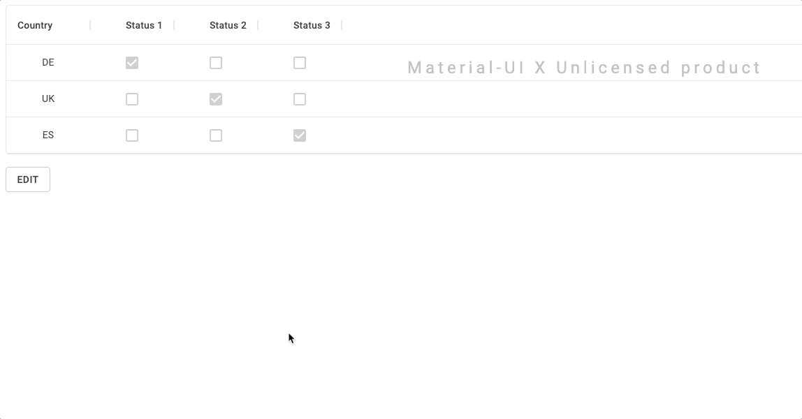

# Description

This repository is a demo showing how to use the MUI XGrid to produce a table in which all cells are fully controlled and editable by external buttons. Here is a summary of how the demo is set up:

1. Using `renderCell` to render checkboxes.
2. Using the `apiRef` and calling `setCellMode` on all the cells to turn them into edit mode.
3. Using `preventDefault` to disable the built-in XGrid events (e.g. blur, focus, click, double click, etc.)
4. Using the `apiRef` and calling `setCellMode` on all the cells to turn them back into view mode.
5. Using `setEditCellProps` from the api to be able to adjust the edit model and also using the actual `editRowsModel` prop to be able to control and listen on the edit model.

# Use Case

This demo could be useful in a typical administration tool where some users would only have read access to the table, whereas others would be able to write to it. The writing mode could be reached by click on "unlock" and then editing multiple cells at once to eventually click "save" and process the changes as desired.

# Demo

# Disclaimer

Keep in mind that this uses the commercial MUI XGrid package and this repository is just for learning purposes. Please refer to https://material-ui.com/store/items/material-ui-pro/ if you would like to use this in production.

# References

- https://github.com/mui-org/material-ui-x/issues/203
- https://github.com/mui-org/material-ui-x/issues/1381
- https://github.com/mui-org/material-ui-x/pull/1287 (Source of documentation until the official docs pages are released)
